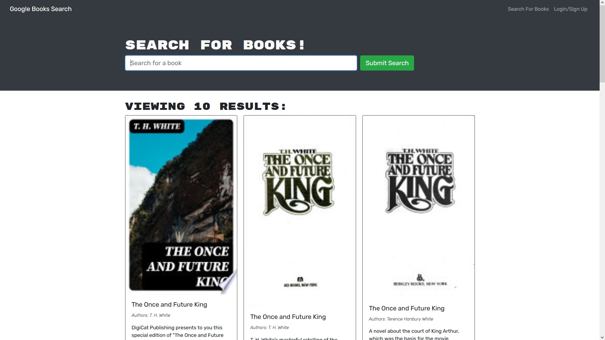
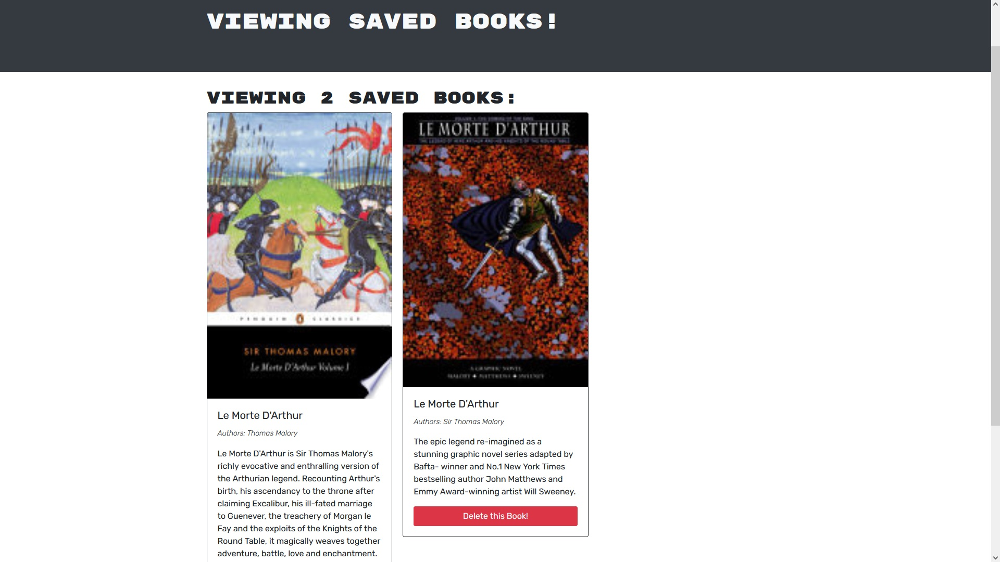

# MERN Book Search Engine

  
## Table of Contents
- [Description](#description)
- [Installation](#installation)
- [Usage](#usage)
- [Questions](#questions)

## Description:

This is a simple search engine interfacing with a Google book search API to allow the user to search for books and save their favorites using MongoDB to save users and their saved books.

It was originally using a RESTful API before I modified it to use Apollo Server for GraphQL. This should in theory allow it to more easily handle larger amounts of data and customize queries and mutations for any future development.


### Installation

To run the client and server locally, get the code at the [Github Repo](https://github.com/shanep42/world-library-book-search), then use 
```
npm run develop
```
from the root directory (where you should find this README!)

### Usage
To look for a needed book, save it in your memory and use it later if needed or you delete the list that you have created after you sign in to get your info after its been saved in the local storage


### Screenshots

 


### Questions? 
For any questions, please contact me with the information below:

[Email](mailto:shanep42@gmail.com)

[Github Profile](https://github.com/shanep42)